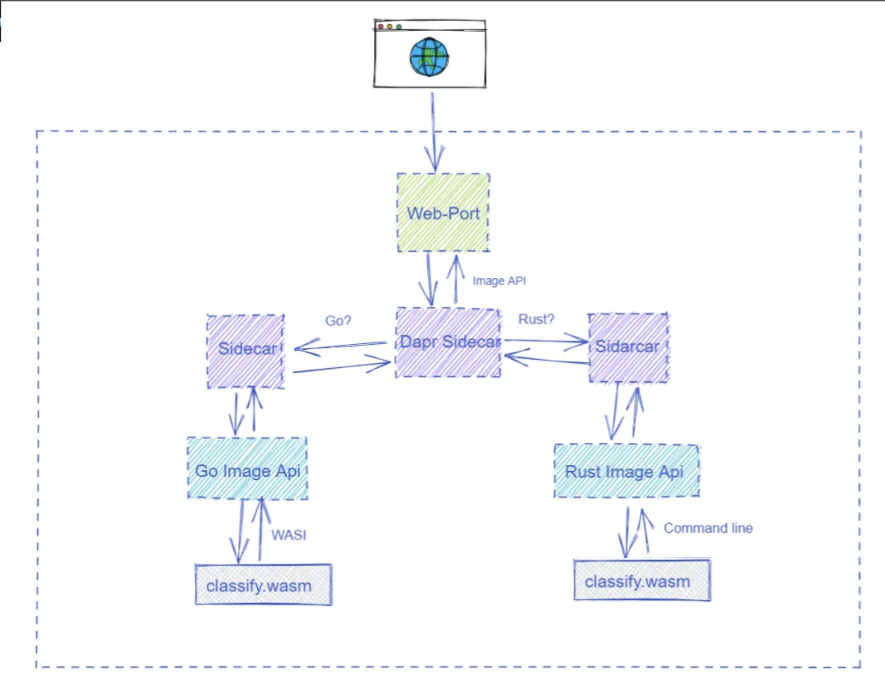
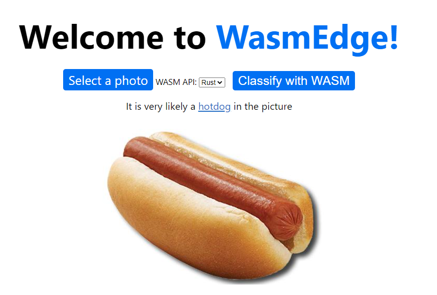

## 演示和指南


## 1. 介绍

[DAPR](https://dapr.io/) 是一个可移植的事件驱动型运行时，它使任何开发人员都可以轻松构建在云和边缘上运行的弹性、无状态和有状态应用程序，并包含语言和开发人员框架的多样性。 这是一个由微软孵化的[开源](https://github.com/dapr/dapr)项目。

[WasmEdge](https://github.com/WasmEdge/WasmEdge) 是一款开源、高性能、可扩展且硬件优化的 WebAssembly 虚拟机，适用于汽车、云、人工智能和区块链应用。

在此应用程序中，我们创建了一个有关于Serverless的深度学习模型在Wasmedge中的部署的简单演示，其中主要包括利用go的api接口和wasi-socker来完成在wasmedge中深度学习的应用。

## 2. 结构

这个项目主要由4个部分组成:

* The [Web port service](./web-port)

它是一个简单的 Go Web 应用程序，它公开为整个应用程序的端点。它将呈现一个静态的HTML页面，供用户上传图像，并从用户接收图像，将请求重定向到内部图像API。

* The [image service in WasmEdge](./image-api-wasi-socket-rs)

此 Dapr 服务是用 Rust 编写的，并编译为 Web 组件。在 WasmEdge 运行时中运行的 Web 组件字节码程序创建一个 HTTP 服务，该服务侦听来自其他 Dapr 应用程序（包括 [web port](./web-port)）的 RPC 请求。并对请求的图片调用深度学习模型

* The [image service in Golang](./image-api-go)
 
这个服务是使用go语言编写的，可以调用Tensorflow的图像分类的wasm文件。



## 3. 环境准备

* [Install Golang](https://golang.org/doc/install)
**Note** Package managers like apt will only install older versions of go i.e. go `1.13.8`, so please use link above to install go version `1.17.1` or higher.
```bash
wget -c https://dl.google.com/go/go1.19.2.linux-amd64.tar.gz
sudo rm -rf /usr/local/go && sudo tar -C /usr/local -xzf go1.19.2.linux-amd64.tar.gz
##在$HOME/.profile中设置如下命令：
export PATH=$PATH:/usr/local/go/bin
##
source $HOME/.profile
go version
## 打印出go版本号即安装成功
```
* [install Rust](https://www.rust-lang.org/en-US/install.html)
```bash
curl --proto '=https' --tlsv1.2 -sSf https://sh.rustup.rs | sh
## 根据屏幕的指示来完成安装
rustc --version
## 打印出rustc版本号即安装成功
cargo --version
## 打印出cargo版本号即安装成功
```
* [Install Docker](https://docs.docker.com/desktop/install/ubuntu/)
```bash
curl -fsSL https://get.docker.com | bash -s docker
docker -v
sudo usermod -aG docker [username]
```

* [Install Dapr](https://docs.dapr.io/getting-started/)
```bash
wget -q https://raw.githubusercontent.com/dapr/cli/master/install/install.sh -O - | /bin/bash
dapr -v
dapr init
dapr -v
```
* [Install WasmEdge](https://github.com/WasmEdge/WasmEdge/blob/master/docs/install.md)
```bash
curl -sSf https://raw.githubusercontent.com/WasmEdge/WasmEdge/master/utils/install.sh | bash -s -- -e all -v 0.9.0
```
* [Install RustWasmc](https://github.com/second-state/rustwasmc)
```bash
curl https://raw.githubusercontent.com/second-state/rustwasmc/master/installer/init.sh -sSf | sh
```
## 4. 运行
 

### Start the web-port service

```bash
cd web-port
dapr run --app-id go-web-port \
         --app-protocol http \
         --app-port 8080 \
         --dapr-http-port 3500 \
         --components-path ../config \
         --log-level debug \
         ./web-port
```

### Start the WasmEdge microservice for image processing

```bash
cd image-api-wasi-socket-rs
dapr run --app-id image-api-wasi-socket-rs \
         --app-protocol http \
         --app-port 9005 \
         --dapr-http-port 3503 \
         --components-path ../config \
         --log-level debug \
	 wasmedge ./target/wasm32-wasi/debug/image-api-wasi-socket-rs.wasm
```

```bash
cd image-api-go
dapr run --app-id image-api-go \
         --app-protocol http \
         --app-port 9003 \
         --dapr-http-port 3501 \
         --log-level debug \
         --components-path ../config \
         ./image-api-go
```

After all the services started, we can use this command to verify:

```bash
dapr list
```

```
  APP ID                     HTTP PORT  GRPC PORT  APP PORT  COMMAND               AGE  CREATED              PID
  go-web-port                3500       44483      8080      ./web-port            15m  2021-10-23 12:19.59  270961
  image-api-wasi-socket-rs   3503       41775      9005      wasmedge              9m   2021-10-23 12:25:27  294758
  image-api-rs               3502       41661      9004      ./target/release/...  9m   2021-10-23 12:25.27  285749
  image-api-go               3501       34291      9003      ./image-api-go        9m   2021-10-23 12:25.27  285852
```

## 6. Online Demo: Dapr-WasmEdge

[Access the demo here](http://114.132.210.248/)



